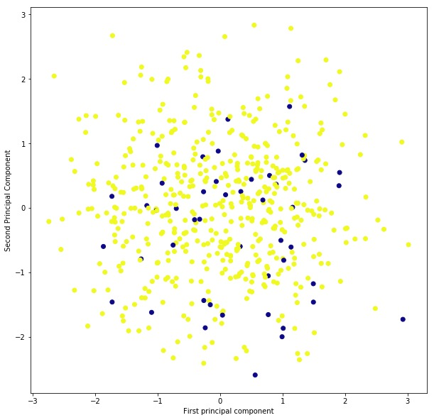

##Report : 


##Introduction : 

####This dataset contains 

This dataset contains records of simulation crashes encountered during climate model uncertainty. A total of 18 model parameters were used.  A brief overview Class climate models are subject to fail or crash for a variety of reasons. Quantitative analysis of the failures can yield useful insights to better understand and improve the models. A climatic model can fail due to various factors, and there was a study done by the author who applied `SVM` to predict the probabilities of the crashes by using the below parameters. 

What I've trying doing my analysis is to find the relavant features whcih could be more useful in predicting the climate change. I've used various models for comaprison and trying to find the best. I purposefully didn't used SVM here as it has been used in other study published. 


The causes of the simulation failures were determined
through a global sensitivity analysis. Combinations of 8 parameters
related to ocean mixing and viscosity from three
different POP2 parameterizations were the major sources of
the failures. This information can be used to improve POP2
and CCSM4 by incorporating correlations across the relevant
parameters. Our method can also be used to quantify, predict,
and understand simulation crashes in other complex geoscientific
models.

Attributes used :


|   Variables |   Description |
|---|---|
| vconst_corr  |  variable viscosity parameter |
|  vconst 2  | variable viscosity parameter  |
| vconst_3   |  variable viscosity parameter |
| vconst_4  |  variable viscosity parameter |
|  vconst_5 |  variable viscosity parameter |
|  vconst_7 |  variable viscosity parameter |
| ah_corr  | diffusion coefficient for Redi mixing (ah) and background horizontal diffusivity within the surface boundary layer (ah bkg srfbl)  |
| ah_bolus   |  diffusion coefficient for bolus mixing |
|slm_corr   |   maximum slope for bolus (slm b) and Redi terms (slm r)|
|  efficiency_factor |   efficiency factor for submesoscale eddies|
| tidal_mix_max  |  tidal mixing threshold |
| vertical_decay_scale  | vertical decay scale for tide induced turbulence  |
|  convect_corr | tracer (convect diff) and momentum (convect visc)mixing coefficients in diffusion option  |
|bckgrnd_vdc1   |  base background vertical diffusivity |
|  bckgrnd_vdc_ban |   Banda Sea diffusivity|
| bckgrnd_vdc_eq  |   equatorial diffusivity|
|bckgrnd_vdc_psim   |  maximum PSI induced diffusivity |
|  Prandtl | ratio of background vertical viscosity and diffusivity  |
|  Outcome  | 0/1 Response variable  |

Total : 18 features were used 
y - Outcome 
Total count - 540 


#### Step 1 Descriptive analysis 

>- No missing values 
>- Data seem to be in standard scale 


#### Step 2 Data Visualization 

Since there are 18 features, and it wasn't possible to plot all of them. Selectively also I couldn't choose as this is a new domain for me. I decided to squish the variables into low dimension and use PCA instead for visualization purpose.

### PCA 

#####Visualizing 18 features into two features  and representing in 2-d space. 




#####Checking for correlation between the variables to check if that matters. Looks like  figure above there is no high coorelation between two variables, it means predictors are good for predictions


#### Feature and model selection steps
 
 
#####1st Model 

Firstly I decided to fit all the feaures on DT, just before I decide to run feature slection how good are features in terms of prediction. Results were very encouraging with DT as well. Got a test accuracy close to `90%` with all the features. 

#####2nd Model 

After fitting in DT, I decided to check how well Random forst will do on this model. With `100` estimators , accuracy went up to `92%`.  Features were good predictors.  


#####3rd Model  feature selection 

I decided to do cross validation on the model, even though first two runs on RF and DT proved almost all fetures are contributing towards prediction. USed three  selection parameters by giving no of estimators to `n_estimators = [100,200,1000]`  depth as `max_depth = [2,5,8,10]` and selection no of features as `max_features = [1,5,8,10,12,15] `. The results were encoraging with accuracy `0.948181`, and no of esitmators =`200.0`, with depth = `5` and most no of features `8`. This was encoraging. I wanted to try more models. 


#####4th Model  feature selection  Logistic regression - no penalty 

The results were good as expected, with accuracy close to `92%` and no of features selected will be `18` in this case. 


#####5th Model  feature selection  Logistic regression - L1 


This was the best results so fat with l1 so far with accuracy close to `95` and no of features selected were `13` . Most important this model was simple to be rolled out in production and interperability is easy. 


Features selected from L1 : ['vconst_corr',
 'vconst_2',
 'vconst_3',
 'vconst_5',
 'vconst_7',
 'ah_corr',
 'ah_bolus',
 'slm_corr',
 'efficiency_factor',
 'bckgrnd_vdc1',
 'bckgrnd_vdc_ban',
 'bckgrnd_vdc_psim',
 'Prandtl'].  In total  `13` features. 


#####6th Model  feature selection  Logistic regression - L2


Results of these were not as bad, accuracy was close to 93% with no of features close to 17. 


#####7th Model  feature selection  logistic  L1 Backward 

The results of this was also very encouraging, with backwards selection criteria I was managed to get accuracy upto `95%` with `6` features.  Couldnt extract the fatures to fit the model. Have to invetigate it further. 


#####8th Model  feature selection  logistic  L2 Backward

Results had a lot of randomnsess. I decided not to use this model. As the weights of the coefficients were vey high 


#####9th Model  feature selection  Model 9 CV using L1 and L2 penealty

Mean square increased to `96%` for c `1.5`. It uses all the features. This is a good model for prediction. 


|   sno|  Model | TestAccuracy |  h1 | h2  |  features selected 
|---|---|---|---|---|---|---|---|
| 1  |  DT | .903704 |   |   |  18  |
|  2 | Random Forest  |.9259  |  n_estimators=100 |   |   18| 
|  3 | Cross Validation   |.9481 |  n_estimators=200 |  dept= 5	 |  8	 | 
|  4 | Logistic no penalty  | .9259  |   |   | 18  | 
|  5 | Logistic L1  | .9481  |    |  |   13| 
|   6| Logistic L2  |.9259   |   |   |   17| 
|  7 |  Logistic L1 + Backward  | .948148  |   |   |   6| 
|   8|  Logistic L2 + Backward   |0.9333   |   |   |  4 | 
|  9 |  Model 9 CV using L1 and L2 penealty |0.962996  | c=1.5  | cv=5 ,L1| 18  |  


##### Conclusion : I decided model 5, logistic regression was the best out of the models that I have tried.  So I decided to give it a try I fitted both logistic regression and random forest in reduced no of features to see the performance. Please find below the code along with the results. 


```
climate_data=pd.read_csv('climate.csv')

X_more = climate_data[["vconst_corr","vconst_2","vconst_3","vconst_5","vconst_7","ah_corr",
          "ah_bolus","slm_corr","efficiency_factor","bckgrnd_vdc1","bckgrnd_vdc_ban","bckgrnd_vdc_psim","Prandtl"]]

y_more = climate_data['outcome'].values
# Splitting the dataset in 25% train and test 

X_train, X_test, y_train, y_test = train_test_split(X_more, y_more, test_size=0.25)

#penalty l1
model_l1 = LogisticRegression()

# Fitting the model 
model_l1.fit(X_train,y_train)

pred = model_l1.predict(X_test)

# coefficient calculation and error calculation 

sf_model = np.sum(model_l1.coef_/max(model_l1.coef_) >= 1e-6)
v_error = np.mean(model_l1.predict(X_test) != y_test)

accuracy = np.mean(pred==y_test)
# printing the features, and error

print(' L1 regularization: no of features ', sf_model)
print(' L1 regularization: accuracy ', accuracy)


# random forest model 

rfc = RandomForestClassifier(n_estimators=100)
rfc.fit(X_train, y_train)

rfc_pred = rfc.predict(X_test)
smse = sum(rfc_pred != y_test) / len(y_test)

Accuracy = 1-smse

#print('Test error = %f' % smse)
print('Accuracy = %f' % Accuracy)
print('Error = %f' % error)
error=1-Accuracy
```


```
Using logistic regression 

L1 regularization: no of features  13
L1 regularization: accuracy  0.896296296296

Using Random forest

Accuracy = 0.903704
Error = 0.074074
```


[python notebook](../analysis.ipynb) 


[Reference paper](https://www.geosci-model-dev.net/6/1157/2013/gmd-6-1157-2013.pdf)

[UCI Data Source](https://archive.ics.uci.edu/ml/datasets/climate+model+simulation+crashes)
